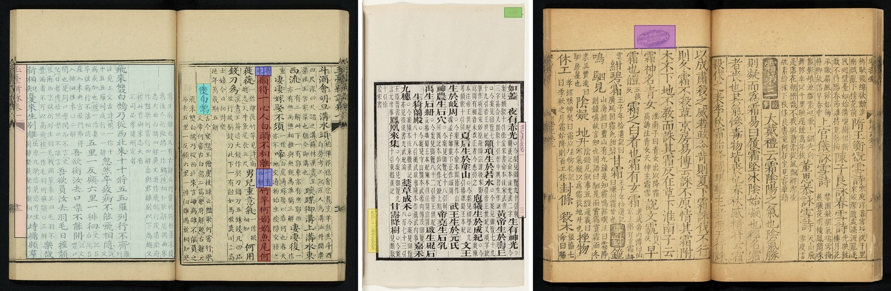
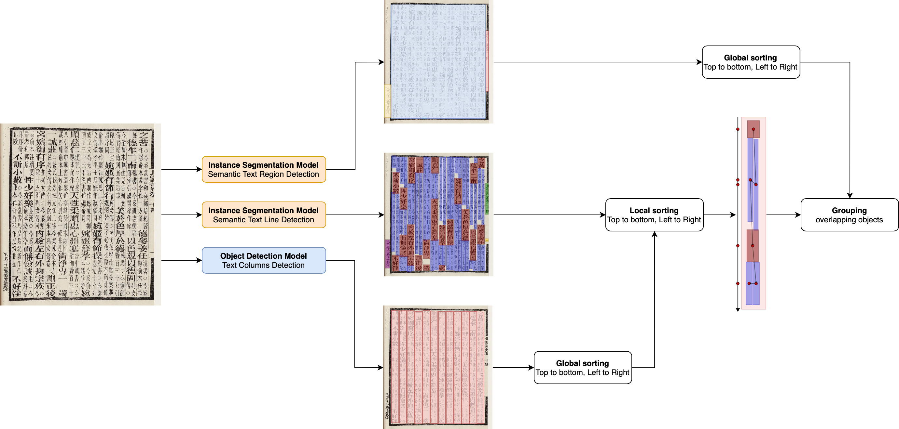

# CHI-KNOW-PO
HTR ground-truth of the CHI-KNOW-PO project.

The CHI-KNOW-PO project aims to digitize a corpus of poetic anthologies, commentaries, dictionaries and encyclopedias from the Chinese medieval period (ca. 200-1000) and process them using HTR.

[Official page of the htr project](https://www.collexpersee.eu/projet/chi-know-po-corpus/)

[Documentation of the research project](https://chi-know-po.gitpages.huma-num.fr/)

<figure>
    
</figure>

## Dataset composition (v1.1)

To date, dataset contains 327 images, for a total of:

* 1.248 TextRegions
* 13.759 TextLines
* 104.536 Glyphs

## Images

The dataset (images + XML) is available on [Zenodo](https://zenodo.org/records/14452717).

## Ground-truth specifications

TBD

### Informations levels

We provide for each image a pageXML file containing three level of information:
* TextRegion localisation, with a semantic tag (e.g. `MainText`), following the [SegmOnto ontology](https://github.com/SegmOnto/Guidelines);
* Baseline localisation and surrounding polygon of the line. Each baseline contains a semantic tag;
* Text.

```xml
    <TextRegion id="79718" custom="structure {type:MainText;}">
      <Coords points="2575,4313 2575,2861 2563,1405 219,1413 216,4307 2575,4313"/>
      <TextLine id="870481" custom="structure {type:Text;}">
        <Coords points="2491,1414 2414,1414 2414,1515 2392,1534 2411,1584 2392,1627 2411,1679 2397,1732 2414,1751 2397,2082 2417,2102 2400,2178 2419,2206 2400,2258 2425,2338 2571,2352 2559,1411 2491,1414"/>
        <Baseline points="2492,1415 2504,2327"/>
        <TextEquiv>
          <Unicode>見惡焉其終也已</Unicode>
        </TextEquiv>
      </TextLine>
      <TextLine id="870482" custom="structure {type:Commentary;}">
        <Coords points="2535,2356 2488,2356 2477,2395 2493,2507 2474,2545 2493,2595 2474,2732 2491,2822 2477,2852 2493,2998 2480,3025 2493,3132 2482,3250 2502,3266 2641,3258 2630,2354 2535,2356"/>
        <Baseline points="2536,2359 2552,3267"/>
        <TextEquiv>
          <Unicode>○今案見論語陽</Unicode>
        </TextEquiv>
      </TextLine>
```

Annotations have been made on the [Calfa Vision platform](https://vision.calfa.fr), a free web-based annotation tool for documents and images designed for Oriental scripts.

## Some results

For HTR, we have first train a generic model with all the data, using [Calfa Vision platform](https://vision.calfa.fr), then (re)fine-tuned this generic model with the targeted manuscript. On a new in-domain test set, we get the following results:

| **Manuscript**       | **N°** | **Accuracy**      |
|-----------------------|--------|-------------------|
| Li Wenxuan           | A-1    | 99.38 (± 1.2)     |
| Liuchen Wenxuan      | A-2    | 98.84 (± 1.8)     |
| Yutai                | A-3    | 98.52 (± 1.2)     |
| Tangshi              | A-4    | 99.25 (± 1.8)     |
| Beitang              | S-1    | 98.76 (± 1.8)     |
| Bowu zhi             | S-2    | 99.18 (± 1.8)     |
| Chuxue               | S-3    | 97.57 (± 1.7)     |
| Erya                 | S-4    | 96.57 (± 0.4)     |
| Maoshi shu           | S-5    | 98.42 (± 1.8)     |
| Yiwen                | S-6    | 98.72 (± 1.7)     |
| Zhibuzu              | S7     | 98.70 (± 1.8)     |
| Shiwen leiju         | T-1    | 97.47 (± 4.5)     |
| Qimin yaoshu         | T-2    | 99.35 (± 2.8)     |
| Xinzhai              | T-3    | 97.61 (± 3.2)     |

For the reading order, we have defined a three step approach, combining a local sorting and a global sorting, achieving a 97.81% of accuracy.

<figure>
    
</figure>

## To cite this work

```bibtex
@InProceedings{10.1007/978-3-031-70642-4_3,
author="Bizais-Lillig, Marie
and Vidal-Gor{\`e}ne, Chahan
and Dupin, Boris",
editor="Mouch{\`e}re, Harold
and Zhu, Anna",
title="Optimizing HTR and Reading Order Strategies for Chinese Imperial Editions with Few-Shot Learning",
booktitle="Document Analysis and Recognition -- ICDAR 2024 Workshops",
year="2024",
publisher="Springer Nature Switzerland",
address="Cham",
pages="37--56"
}
```

## Acknowledgments
